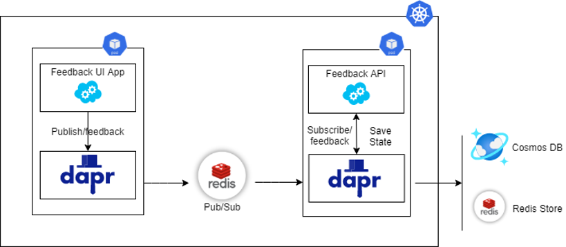

# DaprDemoApp
 Dapr Demp Application - Server Side Blazor Application - Publishes to local queue component defined by DAPR

# DAPR

Dapr is  Distributed Application runtime - An open source, event driven , portable runtime that helps to build distributed system on cloud and on edge systems.

Visit DAPR Official Documentation at - [DAPR](https://dapr.io/)

# About this Repository

*Dapr Demo App*

 Dapr Demp Application - Server Side Blazor Application - Publishes to local queue component defined by DAPR

This repository contains the front end code and publishes to local component *pubsub.redis* defined as a component. 

Backend API and Component Definition Available at - [Dapr Demo API](https://github.com/amreshkris/daprDemoAPI)

# Architecture Diagram

